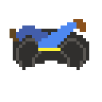

# Inner-Tube Climber

[Live demo](https://snoringcatgames.github.io/inner-tube-climber/dist/web/index.html)

## Software used

-   [Godot](https://godotengine.org/) was used to create this game.
-   [Aseprite](https://www.aseprite.org/) was used to create the images.
-   [Bfxr](https://www.bfxr.net/) was used to create the sound effects.
-   [DefleMask](https://deflemask.com/) was used to create the music.
-   [Trello](https://trello.com/b/GvuTgtRC/ludum-dare-47) was used for brainstorming and planning.
-   [ShaderV](https://github.com/arkology/ShaderV) was used for the custom noise-based fog shader.
-   [Pixel FX Designer](https://codemanu.itch.io/particle-fx-designer) was used for a couple collision particle effects.
-   [Crypto UUID v4](https://github.com/Yukitty/godot-addon-crypto_uuid_v4).
-   [Google Analytics](https://analytics.google.com).

## Licenses

-   The code is published under the [MIT license](LICENSE).
-   The art assets (files under `assets/images/`, `assets/music/`, and `assets/sfx/`) are published under the [CC0 1.0 Universal license](https://creativecommons.org/publicdomain/zero/1.0/deed.en).
-   This project depends on various pieces of third-party code that are licensed separately. [Here is a list of these third-party licenses](./docs/third-party-licenses.txt).

