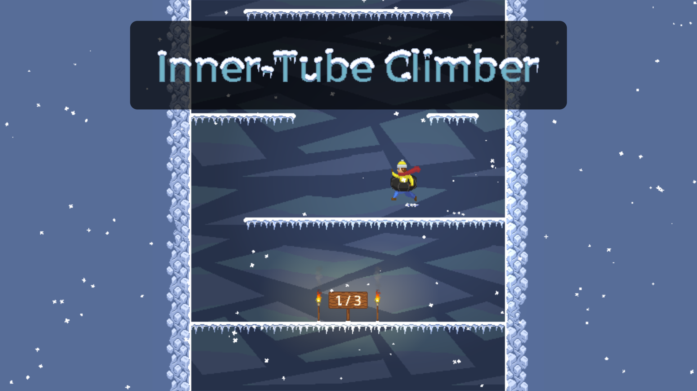

# stuck-in-an-inner-tube

_**Demo: https://levilindsey.github.io/stuck-in-an-inner-tube/dist/stuck-in-an-inner-tube.html**_

_**Gameplay video: https://www.youtube.com/watch?v=QeTW9v1jYFg&list=PLIuJN99AFOPQTZYVOV1TE0cixo9VKPieK**_

_Oh no! The player is stuck inside a "loop"--that is, their inner tube--from a tragic inner-tubing accident that left them stuck in the bottom of an endless crevasse!_

This is an endless climber (2D platformer) game, with novel wall-bouncing mechanics!

## Ludum Dare 47

_**Ludum Dare 47 Submission: https://ldjam.com/events/ludum-dare/47/stuck-in-an-inner-tube/**_

This game is based off of a "Compo" submission for the [Ludum Dare 47 game jam](https://ldjam.com/events/ludum-dare/47/stuck-in-an-inner-tube/). You can see Levi's original submission version at https://github.com/levilindsey/tube-climber.

### The theme: "Stuck in a loop"

The theme for the game jam was "stuck in a loop". This game addresses the theme in two ways:
1.  The player is stuck inside a "loop"--that is, their inner tube--from a tragic inner-tubing accident.
2.  The vertically-scrolling level has no end, it "loops" through previous platforms if you get far enough.

## Software used

-   [Godot](https://godotengine.org/) was used to create this game.
-   [Aseprite](https://www.aseprite.org/) was used to create the images.
-   [Bfxr](https://www.bfxr.net/) was used to create the sound effects.
-   [DefleMask](https://deflemask.com/) was used to create the music.
-   [Trello](https://trello.com/b/GvuTgtRC/ludum-dare-47) was used for brainstorming and planning.
-   [ShaderV](https://github.com/arkology/ShaderV) was used for the custom noise-based fog shader.
-   [Pixel FX Designer](https://codemanu.itch.io/particle-fx-designer) was used for a couple collision particle effects.

## Licenses

-   The code is published under the [MIT license](LICENSE).
-   The art assets (files under `assets/images/`, `assets/music/`, and `assets/sfx/`) are published under the [CC0 1.0 Universal license](https://creativecommons.org/publicdomain/zero/1.0/deed.en).
-   This project depends on various pieces of third-party code that are licensed separately. [Here is a list of these third-party licenses](./docs/third-party-licenses.txt).

